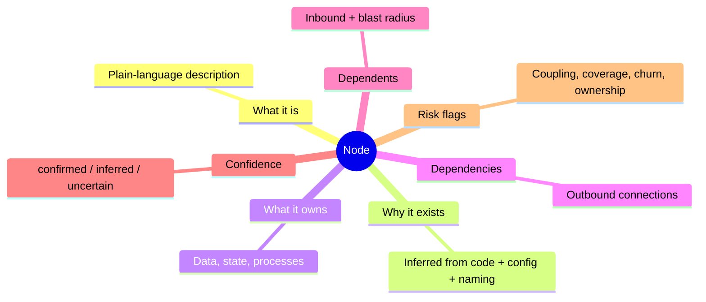
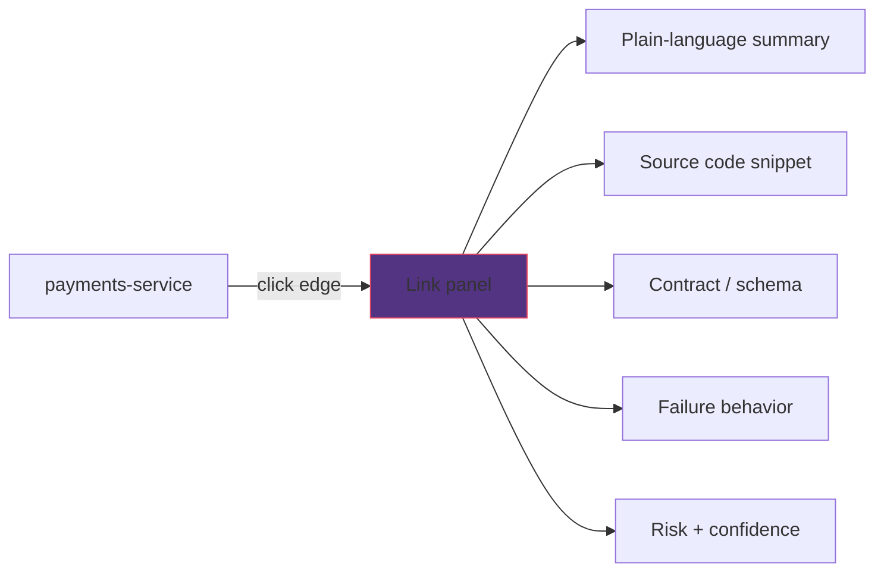
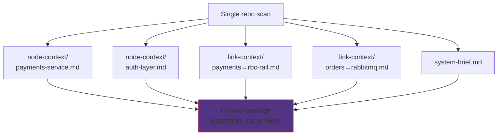
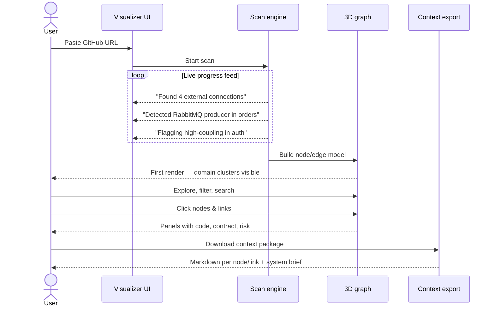
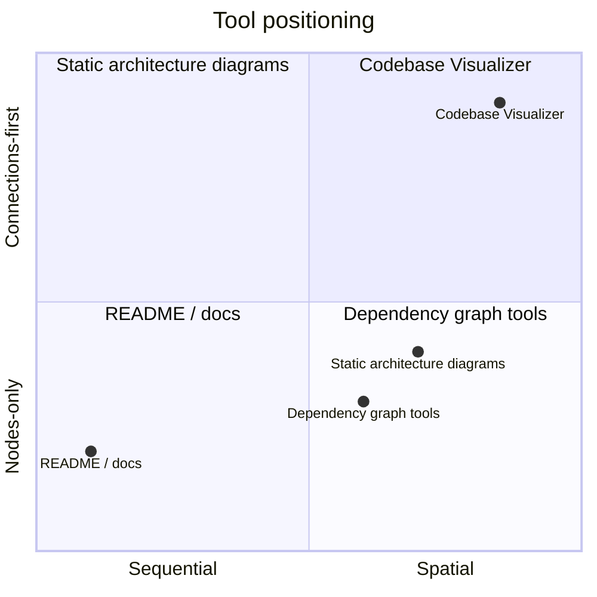
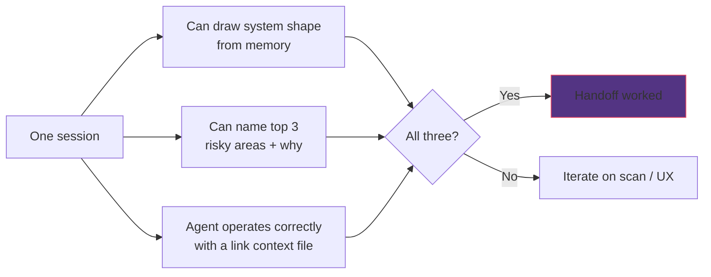

# PRD: Codebase Visualizer — 3D System Intelligence for Complex Inherited Codebases

> **One-liner:** Paste a GitHub repo URL → get a navigable 3D graph of the system + agent-ready context files for every connection.

---

## The Problem

Inheriting a large codebase that connects to multiple external services, queues, and dependencies is one of the hardest things in engineering. You can read the code. You can read the docs. Neither gives you a mental model of the *whole system* — how it breathes, what touches what, where the risk actually lives.

At scale (e.g. a payments service at a bank connecting to 7 downstream systems, queues, auth layers, third-party APIs) no document, graph, or chat interface is enough. You need to **see** the system and **move through it** until it makes sense.

```mermaid
flowchart LR
    subgraph today["What you have today"]
        CODE[Source code]
        DOCS[Docs / README]
        CHAT[Chat / search]
    end

    subgraph gap["What's missing"]
        MODEL[Mental model of<br/>the whole system]
    end

    CODE --> MODEL
    DOCS --> MODEL
    CHAT --> MODEL

    style gap fill:#1a1a2e,stroke:#e94560
```



**This tool** takes a GitHub repo link and turns the full system — code, connections, dependencies, services — into a navigable 3D environment. As a byproduct, it generates structured context that agents can consume to operate on the same codebase without hallucinating intent.

---

## Who This Is For

| Persona | Use case |
|---------|----------|
| **Engineer inheriting a repo** | Build a mental model fast without weeks of grepping |
| **Developer onboarding** | Understand how a multi-service system fits together |
| **Agent / AI tooling** | Get grounded, structured context before making changes |

---

## System Overview

Three layers, one scan:

```mermaid
flowchart TB
    subgraph input["Input"]
        GH[GitHub repo URL]
    end

    subgraph scan["Scan engine"]
        S1[Code structure & imports]
        S2[Service calls & API contracts]
        S3[Config, env refs, queues]
        S4[Risk & confidence scoring]
    end

    subgraph output["Output"]
        G3D[3D navigable graph]
        PANEL[Node & link detail panels]
        CTX[Agent context package<br/>markdown per node/link]
    end

    GH --> S1 & S2 & S3
    S1 & S2 & S3 --> S4
    S4 --> G3D & PANEL & CTX

    style input fill:#0f3460,stroke:#16213e
    style scan fill:#16213e,stroke:#533483
    style output fill:#533483,stroke:#e94560
```



| Layer | Purpose | Consumer |
|-------|---------|----------|
| **3D graph** | Spatial exploration of the system | Human |
| **Detail panels** | Code, contracts, risk on click | Human |
| **Context package** | Structured markdown per node/link | Agent |

Human understanding and agent context are generated from the **same scan** — always in sync.

---

## Core User Flow

```mermaid
flowchart TD
    A[Paste GitHub repo URL] --> B[Scan repo]
    B --> C[3D graph renders]
    C --> D{User explores}
    D --> E[Click node → node panel]
    D --> F[Click edge → link panel]
    F --> G[Code, contract, failure behavior, risk]
    E --> H[Dependencies, blast radius, risk flags]
    D --> I[Filter / search / zoom]
    C --> J[Export context package]

    style A fill:#0f3460
    style J fill:#533483
```



**Step by step:**

1. User pastes a GitHub repo URL
2. Tool scans the full repo — code structure, imports, service calls, config files, environment references, API contracts, queue producers/consumers
3. A 3D graph renders: nodes = services, modules, queues, databases, external deps — edges = connections between them
4. User navigates freely, clicking nodes and links to go deeper
5. Each node/link surfaces structured context: what it is, what it does, what connects to it, what's risky
6. User can dive into any link for code, contracts, flow traces, agent-ready context
7. User walks away with a mental model and confidence to act

---

## The 3D Graph

### Example topology (simplified payments system)

```mermaid
flowchart TB
    subgraph internal["Internal — payments domain"]
        PS[payments-service]
        ORD[orders-module]
        AUTH[auth-layer]
    end

    subgraph infra["Infrastructure"]
        DB[(Postgres)]
        Q[[RabbitMQ]]
    end

    subgraph external["External"]
        RBC[rbc-rail-adapter]
        STRIPE[Stripe API]
    end

    ORD -->|async publish| Q
    Q -->|consume| PS
    PS -->|sync HTTP| RBC
    PS -->|sync HTTP| STRIPE
    PS -->|read/write| DB
    AUTH -->|token validation| PS
    ORD --> AUTH

    style external fill:#e94560,stroke:#533483
    style infra fill:#533483,stroke:#16213e
    style internal fill:#0f3460,stroke:#16213e
```



In the actual 3D view, clusters form by domain, external deps sit at the periphery, and edge weight reflects call criticality.

### What becomes a node

| Node type | Examples |
|-----------|----------|
| Internal services / modules | `payments-service`, `orders-module` (grouped by domain) |
| External connections | Third-party APIs, bank rails, data providers |
| Data stores | Postgres, Redis, S3 |
| Queues / streams | RabbitMQ, Kafka producers & consumers |
| Auth / identity | OAuth providers, token validators |
| Env boundaries | prod vs staging vs dev config surfaces |

### Node panel (on click)



### Edge types

| Type | Visual | Example |
|------|--------|---------|
| Sync API call | Solid line | `POST /v2/transfers` |
| Async message / queue | Dashed | RabbitMQ publish |
| DB read/write | Dotted | SQL queries |
| Shared config / env | Thin | `DATABASE_URL` reference |
| Auth delegation | Labeled | JWT validation handoff |
| Webhook / callback | Bidirectional | Stripe webhook handler |

Edges are **color-coded by type** and **weight-coded by criticality** (inferred from call patterns in code).

### Navigation controls

- Orbit, zoom, pan
- Click node → anchor + highlight connected edges
- "Pull" node toward camera → drill into sub-graph
- Filters: queues only, external only, high-risk only
- Search by name, type, keyword
- Minimap for orientation on large graphs

---

## Diving Deeper: The Link Layer

Edges are **first-class** — most complexity lives in the connections, not the nodes.



### What's in a link panel

| Section | Content |
|---------|---------|
| **Summary** | "The payments module calls the RBC rail adapter to initiate an ACH transfer. Synchronous and blocking." |
| **Code** | The exact function, API call, or queue publish that creates this connection |
| **Contract** | Request/response shape, message schema, event payload |
| **Failure behavior** | Fail hard? Retry queue? Silent drop? |
| **Risk** | Tight coupling, no circuit breaker, undocumented assumptions |
| **Confidence** | Explicit in code vs inferred |

---

## Agent Context Output

Every node and link generates a markdown context file. Together they form a **context package**.



### Example link context file

```markdown
# payments-service → rbc-rail-adapter

## What This Is
The payments service initiates outbound ACH transfers by calling the RBC rail
adapter over a synchronous HTTP connection. This link is on the critical path
for all user-initiated transfers.

## What Connects Here
- Upstream: payments-service (internal)
- Downstream: rbc-rail-adapter (external, owned by RBC infrastructure team)

## Contract
POST /v2/transfers
Request: { amount, currency, source_account, destination_account, idempotency_key }
Response: { transfer_id, status, estimated_settlement }

## Failure Behavior
No circuit breaker. Failures throw a 500 upstream. No retry logic at this layer —
retry is handled by the job queue one level up.

## Risk
High. Synchronous, external, no fallback. Latency spikes here propagate directly
to the user-facing transfer flow.

## Confidence
High — explicit in code and confirmed by integration tests.

## Before You Change This
Understand the idempotency_key contract. RBC will double-process if the same key
is reused across retries. This has caused incidents before (inferred from error
handling comments in payments_service.go:L847).
```

---

## End-to-End Experience



| Phase | What happens |
|-------|--------------|
| **Landing** | Paste URL. Live scan feed — not a generic spinner. |
| **First render** | 3D graph appears, auto-clustered by domain. Shape of system is visible before details. |
| **Exploration** | User follows what confuses them. Risk flags and uncertainty markers guide attention. |
| **Link drill-down** | Code, contract, risk in one panel — no tab switching, no grepping. |
| **Export** | Full context package: one file per link, one per node, plus system brief. |

---

## What Makes This Different



| Differentiator | Detail |
|----------------|--------|
| **Spatial, not sequential** | Systems are non-linear. A 3D graph matches how they actually work. |
| **Links are first-class** | Connections are where complexity, risk, and hidden assumptions live. |
| **Confidence is visible** | Every node/link tagged: `confirmed` / `inferred` / `uncertain`. No false confidence. |
| **Shared context** | Same scan powers the human visualization and the agent markdown files. |

---

## Success Metric

A developer inherits a repo they've never seen. After **one session**:



---

## Scope

### V1 — In scope

- [ ] GitHub public and private repo ingestion
- [ ] 3D graph with nodes and typed edges
- [ ] Node detail panels — summaries + confidence ratings
- [ ] Link detail panels — code, contract, risk breakdown
- [ ] Agent context file generation per link and per node
- [ ] Export: full context package as markdown

### V2 — Out of scope for now

- Live repo sync (graph updates on push)
- PR-level diff visualization ("what does this PR change in the graph?")
- Conversation layer: Slack, PR comments, incident postmortems
- Multi-repo graphs for microservice architectures
- Agent operating directly inside the visualization

---

## Quick Reference

```
GitHub URL
    │
    ▼
┌─────────────┐     ┌──────────────┐     ┌─────────────────┐
│  Scan repo  │ ──▶ │  3D graph    │ ──▶ │  Explore nodes  │
│  (1 pass)   │     │  + panels    │     │  & link edges   │
└─────────────┘     └──────────────┘     └────────┬────────┘
                                                  │
                                                  ▼
                                        ┌─────────────────┐
                                        │ Export context  │
                                        │ package (.md)   │
                                        └─────────────────┘
```
